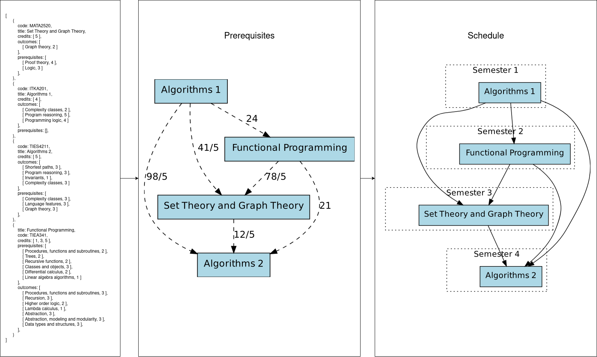

# Gronto

We demonstrate how to construct and schedule a university curriculum by
embedding all courses to a common ontology. The program that does this also
ensures that illegal states (i.e. dependency cycles or duplicate content) do
not appear in the curriculum.



## Related works

- [Liu, H., Ma, W., Yang, Y., & Carbonell, J. (2016). Learning concept graphs from online educational data. Journal of Artificial Intelligence Research, 55, 1059-1090.](https://jair.org/index.php/jair/article/view/11000/26157)
- [Auvinen, T., Paavola, J., & Hartikainen, J. (2014, November). STOPS: a graph-based study planning and curriculum development tool. In Proceedings of the 14th Koli Calling International Conference on Computing Education Research (pp. 25-34).](https://dl.acm.org/doi/pdf/10.1145/2674683.2674689)
- [Stavrinides, P., & Zuev, K. M. (2023). Course-prerequisite networks for analyzing and understanding academic curricula. Applied Network Science, 8(1), 19.](https://doi.org/10.1007/s41109-023-00543-w)
- [Prøitz, T. S. (2023). Consistency in study programme planning and the complexity of curriculum logics. Teaching in Higher Education, 28(8), 1815-1830.](https://doi.org/10.1080/13562517.2021.1931838)
- [Aldrich, P. R. (2014). The curriculum prerequisite network: a tool for visualizing and analyzing academic curricula. arXiv preprint arXiv:1408.5340.](https://doi.org/10.48550/arXiv.1408.5340)
- [Chaplot, D. S., Yang, Y., Carbonell, J., & Koedinger, K. R. (2016). Data-Driven Automated Induction of Prerequisite Structure Graphs. International Educational Data Mining Society.](https://www.educationaldatamining.org/EDM2016/proceedings/paper_149.pdf)

## Prerequisites

```bash
# Make and xdot
sudo apt-get install build-essential xdot

# Racket
sudo add-apt-repository ppa:plt/racket -y
sudo apt-get install racket -y

# Racket Generic Graph Library
raco pkg install graph

# Solver library
raco pkg install rosette
```

## Compiling

```bash
make
```

Two binaries, `./tmp/prerequisites` and `./tmp/scheduler` will be created.

## Running

```bash
# Compute prerequisites
#
# Params:
#   [in]  "data/input.json"       individual courses in questionnaire format
#   [out] "tmp/prerequisites.dot" result dot graph
#   [out] "tmp/output.json"       amended version of input courses
#   [in]  "15"                    threshold for prerequisiteness
#
./tmp/prerequisites data/input.json tmp/prerequisites.dot tmp/output.json 15

# Visualize
xdot tmp/prerequisites.dot

# Schedule the courses (if possible*)
#
# Params:
#   [in]  "tmp/output.json"       individual courses in questionnaire format
#   [out] "tmp/schedule.dot"      result dot graph
#   [in]  "2"                     years in the curriculum
#   [in]  "4"                     semesters per year
#   [in]  "5"                     minimum credits per semeter
#   [in]  "10"                    maximum credits per semeter
#
./tmp/scheduler tmp/output.json tmp/shedule.dot 2 4 5 10

# Visualize
xdot tmp/schedule.dot
```

## Formal notation

- Atomic types:
  - $\mathbb{Q}$ denotes rational numbers.
  - ${S}$ denotes strings.
  - ${W}$ denotes integer weights [1,2,3,4,5,6] representiing Bloom taxonomy.
- Compund types:
  - ${O}$ denotes all ontology nodes, which is equal to ${S} \times {W}$.
  - ${C}$ denotes all courses.
  - ${OP}$ denotes ontology pairs, which is equal to ${O} \times {O} \times \mathbb{Q}$.
  - ${CP}$ denotes course pairs, which is equal to ${C} \times {C} \times \mathbb{Q}$.
- Functions:
  - ${Code} : {C} \to {S}$ maps a course to a code.
  - ${Cred} : {C} \to \mathbb{O}$ maps a course to credits.
  - ${Pre} : {C} \to {O}^\ast$ maps a course to a list of weighted prerequisites.
  - ${Out} : {C} \to {O}^\ast$ maps a course to a list of weighted outcomes.
  - ${f} : {O} \times {O} \to \mathbb{Q}$ gives the distance between two weighted ontology nodes.
  - ${G} : {O}^\ast \times {O}^\ast \to \mathbb{Q}$ gives the distance between two lists of weighted ontology nodes.
  - ${D} : {C} \times {C} \to {CP}$ gives the distance between two courses.
  - ${H} : {CP}^\ast \times \mathbb{Q} \to {CP}^\ast$ gives a list of course pairs with distance less than ${q} : \mathbb{Q}$.

## TODO

- Better demonstrations

## Notes

<details>

<summary>lenghty notes on the topic</summary>

One of the essential goals of software development is the communication of
ideas. To ensure that those ideas are communicated correctly, the tools of
software testing and quality assurance are used.

For example, one ought to write unit tests to ensure that small functional
components of the software produce same results as expected. To top this, some
assertion statements are often placed inside the implementation to check
during runtime that things which should stay invariant stay that way. In the
most rigorous cases, when the correctness of the software is crucial, one must
prove that the software works as intended.

If any of the methods described raise an alarm that the software is not
working properly corrective actions are taken.

In this thesis I argue that curriculum development could be viewed the same way
as software development. First, the requirements of the curricula are agreed in
the admistrative ladder. Then these goals are split into smaller functional
components (courses), by the teaching staff, which serve a specific learning
goal. Finally those components are grouped and sequenced together to work as
guiding path -- much like a program -- to lead incoming student towards a more
useful end state.

But how does one ensure that a curricula does indeed meet the requirements
and ideals that the admistrative ladder has crafted? What are the unit tests,
assertion statements and proofs in the realm of curriculum development? How
does one know when to take corrective actions with their curriculum?

Theses, exams, projects, prerequisite tests and pop quizes all work as runtime
assertions. They ensure that the in-production curricula works, by checking that
students are indeed where they should be. But what to do when assertions are
continuously not met? A buggy program with lots of assertion statements only
screams that things are not as expected, and at best tells us what to fix. But at
a large scale curriculum changes are either costly or impossible. Once a schedule
for courses is decided and teachers have booked their holiday tickets no changes
should be made.

In this thesis I propose, an other mechanism for ensuring quality, which tries
to bring same rigorousness to curriculum planning as proofs in software
development. And this proof can be constructed before the curriculum is moved
to production and students', teachers' and admistrators' time is wasted.

The limitation of this method is that it only concerns the course interfaces,
which are the prerequisites and outcomes. The method is build on the assumption
that *if incoming students are equipped with right prerequisite knowledge then
they will achieve the course outcomes*.

1. Yes, but why?

   - Attending and passing a course without prerequisite knowledge requires
     more effort than needed. This means students waste time and won't learn
     things.

   - Teaching and planning a course for students without prerequisite knowledge
     is near impossible. Most subjects don't have "the one way" to teach
     because incoming students vary.

   - Some sort of prerequisite and outcome documentation is performed
     currently, but it relies on free text fields and varying language. This
     means that everyone uses different phrasing and level of detail which
     easily leads to misunderstanding.

   - Often prerequisites are documented as course codes (TIEP112 has a
     prerequisites TIEP111) or course titles (Programming 1 is prerequisite for
     Programming 2). It is really hard to know what is expected from the
     incoming student.

   - Curriculum module building and scheduling relies on these
     "course-connections" rather than "knowledge-connetions". Paths like
     "Programming 1 -> Programming 2 -> Programming 3" might seem obvious. But
     it is not obvious how much and what knowledge the student has after those
     courses.

   - Not all courses are named with an ordinal attached to them. In which order
     should a student take courses like "signal processing, computer vision,
     and machine learning"?

   - When this happens systematically accross the whole curriculum (downstream
     effect is large) graduation times get longer, curriculum outcomes are not
     reached, and graduates are much worse equipped to become researchers or
     professionals.

   - An organization easily forgets what, how and why it makes decicions.
     Curriculum planning is a massive hurdle each 4 years, even when not that
     much has changed. New people are responsible for planning the curriculum
     and they start everything from scratch. No-one remembers what was done
     last time or 10 years ago. Making the process a bit more automatic and
     invariant to people would help.

2. Is the problem social or technical?

   - **Social**

     - Course prerequisites are based on personal knowledge that might be
       outdated or misguided. "I know what person A and B teach in their
       course." --- person C.

     - The documentation is currently hard to maintain. Teachers and staff
       don't believe that documenting (and scheduling) helps or they just don't
       want to do extra work. "The course topics evolve each year as new
       discoveries are made and research goes forward." - Teacher C

     - Techers want to hold on their freedom to teach and don't want to be
       monitored.

   - **Technical**

     - Current information systems (SISU, TIM, MOODLE, etc.) don't have a good
       data model for a course --- free text is encouraged.

     - Extracting some information is not made easy. Try to come up with a list
       of courses and their contents, of the current curriculum.

     - Modeling the example curriculum (which most students end up following)
       is done by hand and it is error prone.

3. What end user gets?

   - Curriculum development does not have to start from scrach each year.

   - A scheduled curricula. Fast. What we mean is that the system can be
     incorporated in day-to-day operations or the organization.

       - Do we have dependency cycles in the current curriculum?

       - Is there a course that is important but does not have enough
         prerequisites. Could someone teach them? Should we hire someone? What
         kind of skills we need?

       - Is the same information taught somewhere twice? Can we combine
         courses, or introduce people with similar courses to each other?

       - What is the lightest curriculum that can build? What is the heaviest?

   - This also gives more tools for student counceling. For example we can
     give a lower bound in how many semesters the student can graduate.

       - No there is no way you can graduate in a year, if you take one course
         per semester!.

       - If you are willing to work, you can graduate before next christmas if
         you take these courses in this order.

       - Desining model curricula for different students. Some are working and
         can do only 5 credits per semester. How should they proceed?

       - Someone has to graduate fast, does not matter what courses to take. No
         problem, check if curricula with a 6 month timelimit is possible!

4. What end used has to provide?

   - Limits for the solver. (How many years, what work load, etc.)

   - Individual courses embedded into the ontology. (A [questionnaire](https://users.jyu.fi/~tealjapa/kysely) part of
     this masters thesis.)

   - An ontology. As an adjacency matrix/ adjacency lists (ACM included).


5. Is the solution usable more than once?

   - Computing the prerequisite courses is iterable. This feels stable, I have
     no proof.

   - Scheduling depends on all courses. This might be unstable!

6. Test other possible distance metrics?

   - Current is the min-mean-distance weighted by the course credits.

7. Why particular ontology?

   - What else could be used?

      - [2020 Mathematics Subject Classification System](https://mathscinet.ams.org/mathscinet/msc/msc2020.html)

   - What properties should these have for them to work?

      - A way to determine distance between any two items.

      - It must span the space of all courses. Expressiveness of the ontology.
        We must be able to embed all courses to the ontology.

      - [Graph properties](https://en.wikipedia.org/wiki/Graph_property)?

        - No cycles, infinite [girth](https://en.wikipedia.org/wiki/Girth_(graph_theory))

8. How to evaluate and validate the effectiveness of the system?

   - **Short term**

      - Demonstration + Questionnaire. (Tells end user opinion.)

      - Speed. (Must show we do same thing as before but faster.)

      - By analogy or reference. (Must show someone else has done same with good results.)

   - **Long term**

      - Quality of graduating students, grades, jobs, publications, etc.

9. Why did we choose this method/these methods (racket, smt, graphs, ontology, etc) ?

   - Well first we have two problems.

       - Assign prerequisites.

           - Ontology

               - We need some way to tell how "prerequisite" a course is to
                 other courses. In other terms we need some "similarity"
                 measurement of any two courses, and this is a question of
                 semantics. We could use propabilistic solutions i.e. sentence
                 embeddings, but we strive for deterministic methods. Ontology
                 gives semantics and as long as we comply with our requirements
                 in choosing ontology we have a deterministic way of measuring
                 similarity.

               - Ok, but why is probabilistic bad or worse?

           - Graphs

               - They provide a distance between items inctrinsically.
               - They are nice to visualize.
               - ACM ontology is a graph.
               - Construction process can be made deterministic.

       - Schedule courses based on prerequisites (and semester limits).

           - SMT (This was the first thing we tried. Could we show that this is
             the best? or argue that it is Good enough?)

               - There exists lots of literature on University Course
                 Scheduling Problem or UCSP and the likes. From the two class
                 of solutions, exact or heuristic, we prefer exact. USCP is a
                 combinatorial problem and we just want something that performs
                 better than brute force search.

10. Compare to other solutions?

   - [Learning Concept Graphs from Online Educational Data](https://jair.org/index.php/jair/article/view/11000/26157)
   - [STOPS – A Graph-Based Study Planning and Curriculum Development Tool](https://dl.acm.org/doi/pdf/10.1145/2674683.2674689)
   - [Course-prerequisite networks for analyzing and understanding academic curricula](https://doi.org/10.1007/s41109-023-00543-w)
   - [Consistency in study programme planning and the complexity of curriculum logics](https://doi.org/10.1080/13562517.2021.1931838)
   - [The curriculum prerequisite network: a tool for visualizing and analyzing academic curricula](https://doi.org/10.48550/arXiv.1408.5340)
   - [Data-driven Automated Induction of Prerequisite Structure Graphs](https://www.educationaldatamining.org/EDM2016/proceedings/paper_149.pdf)

11. What remains for even better world?

12. End user experiances resulting from the use of this system?

13. What about maintenance? How long does this system survive in an
    organization? Does anyone actually care about this? Why should someone
    care? Can this be revived fast if someone care? Does the technology go
    obsolete? Will the ideas become obsolete? Will the system be adaptable
    to other universities?

</details>

