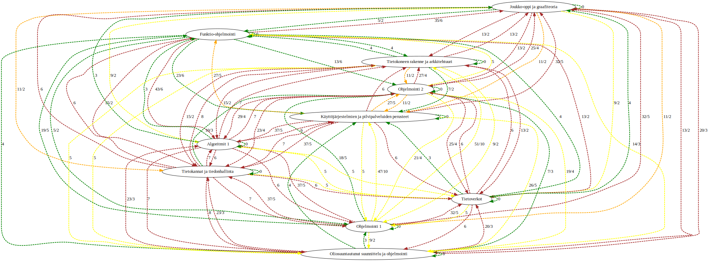
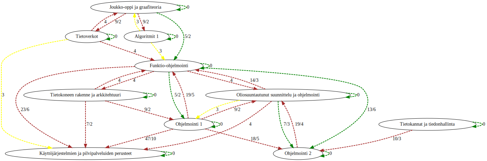
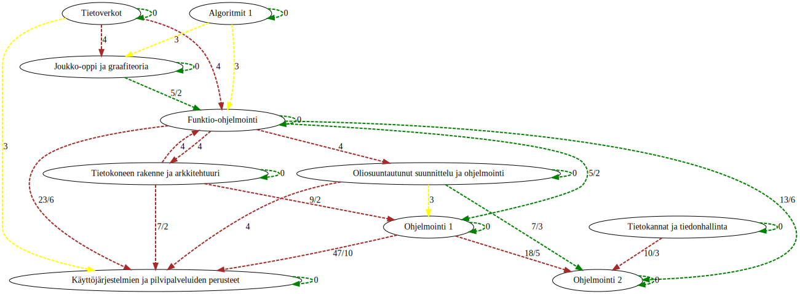

# Gronto

Gronto is short for `GRaphs and ONTology to Opetussuunnitelma's`. Gronto aims to
use [ontology](https://en.wikipedia.org/wiki/Ontology_(information_science)), [graph theory](https://en.wikipedia.org/wiki/Graph_theory), and [satisfiability solvers](https://en.wikipedia.org/wiki/Satisfiability_modulo_theories)
for more formal and repeatable curriculum planning than traditionally.

In detail the goal is to compose a schedule or a curriculum of courses with
given number of years and semesters such that (1) each semester has appropriate 
load in terms of credits and (2) that each year and semester builds on top of 
previous knowledge. These are very natural constraints on a curriculum even 
without more formal methods.

The goal can be achieved when the course prerequisites and outcomes are well
defined from a common ontology where the distance between two nodes can be computed.
Then we can construct a distance for any given pair of courses and assign
prerequisiteness based on that distance.

Suprisingly this seems to produce valid curriculums.

<details>
<summary>Ontology tree</summary>


</details>

## Constructing a distance graph ([distance.rkt](src/distance.rkt))

### Distance function

`f(t, c1, c2) -> d` tells the distance between two courses (c1 and c2) in a given
ontology (t).

For example for two courses:

```
C1:
    outcome1
    outcome2
C2:
    outcome1
    outcome3
    outcome4
```

We have `f` such that is computes the average distance between the nodes of
c1 outcomes from c2 outcomes in the ontology-tree. The steps for this are:

 1. Create a cartesian-product of c1 and c2 outcomes (we will add prerequisites later).
 ```
 ("outcome1" "outcome1")
 ("outcome1" "outcome3")
 ("outcome1" "outcome4")

 ("outcome2" "outcome1")
 ("outcome2" "outcome3")
 ("outcome2" "outcome4")
 ```

 2. Count distance for each pair. This is done by counting taking the paths from
 root to outcome-a and root to outcome-b. Then common part is discarded from least
 ancestor (LCA) and tail lengths are added (see code below). Weight each distance
 by the average of depths of both nodes.

 ```scheme
(define (distance-nodes o n1 n2)
  (let ((p1 (path-from-root o n1))
        (p2 (path-from-root o n2)))
    (define (common l1 l2)
      (filter (lambda (x) (member x l1))
              l2))
    (* (- (+ (length p1) (length p2))
          (* 2 (length (common p1 p2))))
       (/ (* (length p1) (length p2)) 2))))
```

 Resulting in this:
 ```
 ("outcome1" "outcome1" 0)
 ("outcome1" "outcome3" 7)
 ("outcome1" "outcome4" 16)

 ("outcome2" "outcome1" 3)
 ("outcome2" "outcome3" 8)
 ("outcome2" "outcome4" 1)
 ```

 3. Select the minimum for each where source is c1 outcome.
 ```
 ("outcome1" "outcome1" 0)

 ("outcome2" "outcome4" 1)
 ```

 4. Count the average of these.
 ```
 (0 + 1) / 2 = 1/2
 ```

 5. And finally multiply the result with the product of both courses credits
multiplied together.

```
(* weight1 weight2 (average-closest-neighbour-distance t outs pres)))))
```

This distance function has some nice properties:

- Distance from course to itself is `0`. Minimum length from each node to self is 0.

### Map to all courses

`G(t, f, C) -> u` composes a course distance graph (u) such that each edge
between any two courses in the set of all courses (C) is produced by the distance
function (f).

```scheme
(define (G t f C)
    (map (lambda (p)
                 (list (value 'title (car p))
                       (value 'title (cadr p))
                       (f t (car p) (cadr p))))
         (cartesian-product C C)))
```

### Filter

`H(u, th) -> ũ` is a filter removing any edges from source graph (u) below the
threshold value (th) and remove any cycles (out of two "bidirectional" edges
between two nodes remove the larger distance).

```scheme
(define (H u th)
  (define f (filter (lambda (x) (< (caddr x) th)) u))
  ;; Find the smaller of bidirectional edges between same nodes.
  ;; TODO: Does not work when weights are equal.
  (define (find-smaller-if-exists p l)
    (define r (filter (lambda (x) (and (eq? (car x) (cadr p))
                                        (eq? (cadr x) (car p))))
                      f))
    (if (> (length r) 0) ;; counterpart exists
        (if (< (caddr p) (caddr (car r)))
            p
            (car r))
        p))
  (remove-duplicates (for*/list ((p f))
                       (find-smaller-if-exists p f))))
```

Before the filter the graph looks like this ("inf"-edges removed).


Then we apply the threshold filter (th = 5, experimental).


And finally we remove bidirectionals.


From this we can make clear inference on what courses are prerequsite to other
and we can proceed to schedule the courses.

## Schedule ([smt.rkt](src/smt.rkt) and [dot.rkt](src/dot.rkt))

`M(ũ, s) -> m` creates a model curriculum (m) based on the filtered course
distance graph ũ. (A rought idea of this can be visualized with `make all`).

## Usage

```
# Install z3 theorem solver.

apt install z3

# Install racket.

add-apt-repository ppa:plt/racket
apt-get install racket

# Run scripts.
make
```
